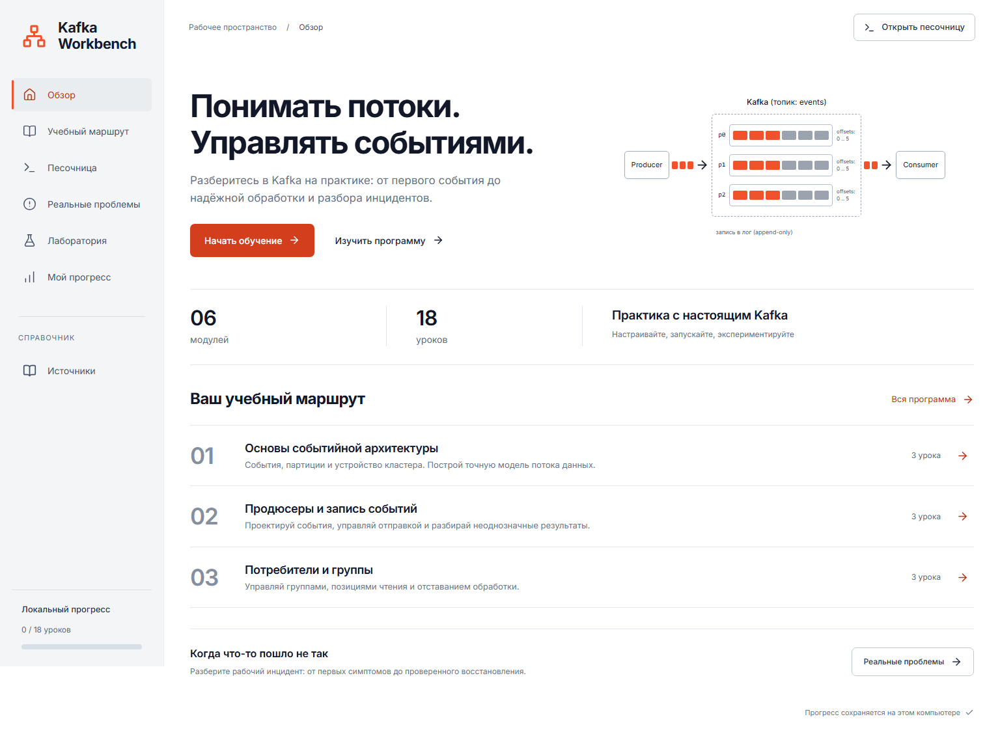
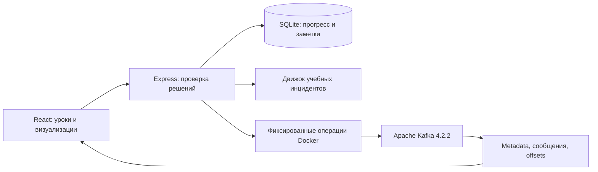

# Kafka Workbench

Русскоязычный тренажёр Apache Kafka: понять поток событий, проверить инженерные решения и повторить эксперимент на настоящем брокере.



## Запуск из GitHub

Нужны Git и **Node.js 24.19+ в ветке 24.x** с npm. Для настоящей лаборатории дополнительно нужен работающий Docker Engine с Linux containers. Уроки, учебная песочница и инциденты работают без Docker.

```sh
git clone https://github.com/Abrakadabra124/kafka-workbench.git
cd kafka-workbench
npm ci
npm run build
npm start
```

Откройте **[http://127.0.0.1:4184](http://127.0.0.1:4184)** и нажмите «Начать обучение». Регистрация, API-ключи и облачный аккаунт не нужны. Это один учебный профиль на локальную установку.

На Windows можно дважды нажать **Start-Kafka-Workbench.cmd**. Скрипт выбирает совместимый Node, устанавливает зависимости из lockfile, собирает приложение, запускает его в фоне и открывает браузер. **Stop-Kafka-Workbench.cmd** завершает только этот сервер. Подробности и восстановление: [OPERATIONS.md](docs/OPERATIONS.md).

GitHub предоставляет исходники и автоматические проверки. Приложение запускается на вашем компьютере; GitHub Pages не исполняет сервер, базу или Kafka.

## Что изучать

- **18 уроков в 6 модулях:** основы, запись, потребители, надёжность, эксплуатация и архитектура. В каждом уроке теория, проверка понимания, инженерная ситуация, объяснение ответа и первоисточники.
- **Песочница событий:** отправка ключей в партиции, чтение, отдельный commit, перезапуск с повторной доставкой, независимые группы, назначение потребителей и committed lag.
- **Реальные проблемы:** шесть типовых инцидентов с наблюдениями, гипотезой, исправлением, последствиями ошибок и отдельной проверкой восстановления. Визуализация показывает состояние потока, анимированное движение событий и историю изменений с паузой и шагами.
- **Настоящая лаборатория:** Apache Kafka 4.2.2, KRaft, создание топика с тремя партициями, запись трёх заказов с ключами, чтение группы и проверка реальных offsets.
- **Сохранение:** SQLite хранит результаты, попытки, заметки и состояния инцидентов. Есть повторение ошибок, JSON-экспорт и явный сброс.

Прогресс урока засчитывается только после двух правильных решений. Открытие страницы баллов не даёт. Повторение сохраняет лучший достигнутый результат и отдельно показывает последнюю ошибку. Это учебный показатель, а не профессиональная сертификация.

## Как заниматься

1. Прочитайте первый урок и объясните разницу между событием и командой.
2. Ответьте на вопрос и разберите инженерную ситуацию. После ошибки прочитайте объяснение и повторите попытку.
3. В песочнице отправьте три события, прочитайте пакет, перезапустите consumer до commit. Наблюдайте повторную доставку, затем подтвердите offset.
4. В разделе «Реальные проблемы» соберите доказательства, выберите причину, исправьте состояние и отдельно подтвердите восстановление.
5. Запустите лабораторию и выполните настоящий цикл записи и чтения. Сравните результат команды с фактическими сообщениями и offsets.
6. Сохраните собственное объяснение в тетради и вернитесь к ошибкам через «Мой прогресс».

## Разработка и проверки

```sh
npm run check
npx playwright install chromium
npm run test:e2e
npm run test:labs
npm audit --audit-level=high
```

`check` запускает TypeScript, тесты и production-сборку. `test:e2e` проверяет пользовательские сценарии, доступность и мобильный экран на изолированной базе. `test:labs` выполняет настоящий цикл Docker/Kafka в отдельном тестовом Compose project и удаляет только свои тестовые ресурсы. Обычный `npm test` не запускает Docker; live-тест явно пропускается без `RUN_LIVE_LABS=1`.

В разработке используйте два терминала: `npm run server` и `npm run dev`. Интерфейс доступен на `http://127.0.0.1:5184`, запросы API идут через ограниченный локальный proxy на `4184`.

Фактические результаты проверок и ограничения: [VERIFICATION.md](docs/VERIFICATION.md). Состав workflow сам по себе не доказывает успешный CI.

## Устройство

React и TypeScript формируют интерфейс и интерактивные модели. Vite собирает его для запуска. Express обслуживает интерфейс и HTTP API на одном адресе. Встроенная в Node.js SQLite сохраняет учебные данные. Сервер скрывает ключи ответов из API курса и самостоятельно оценивает действия.

Лабораторный адаптер запускает только фиксированные команды Docker Compose без shell. Пользовательский ввод не становится командой, именем проекта или адресом брокера. Kafka не публикует порт на хост; приложение выполняет штатные CLI внутри учебного контейнера. Веб-сервер при этом работает с правами локального пользователя Docker, что требует доверенного компьютера.



## Границы результата

Песочница и инциденты явно обозначены как учебные модели. Они не подключаются к production, не воспроизводят все таймеры и протоколы Kafka и не заменяют диагностику реального кластера. Модель описывает обычные consumer groups, не share groups. Учебный hash и распределение партиций упрощены.

Настоящая лаборатория использует один брокер. Она проверяет запись и чтение, но не высокую доступность, quorum recovery или межброкерную репликацию. Сетевые порты приложения открыты только на loopback. Публичный SaaS, многопользовательская изоляция и гарантия нагрузки в этот выпуск не входят.

Исследование сравнивает учебные подходы Apache Kafka, Confluent, Redpanda и других тренажёров проекта. Качество оценивается по проверяемым критериям, без заявления о подтверждённом «уровне бигтех»: [RESEARCH.md](docs/RESEARCH.md).

## Документация

- [Цель и критерии приёмки](docs/PLAN.md)
- [Исследование и сравнение](docs/RESEARCH.md)
- [Повседневные инциденты](docs/INCIDENTS.md)
- [Запуск, резервная копия и восстановление](docs/OPERATIONS.md)
- [Проверки поставки](docs/VERIFICATION.md)
- [Визуальная проверка](docs/DESIGN-QA.md)

Лицензия: [MIT](LICENSE). Apache Kafka является товарным знаком Apache Software Foundation. Проект не связан с Apache, Confluent или Redpanda и не является их официальным курсом.
